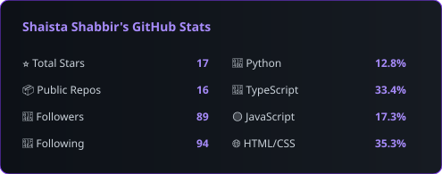
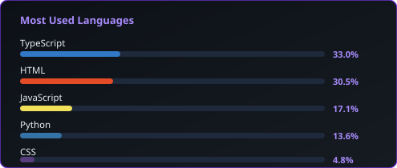

<div align="center">


<!-- Typing animation - reliable service -->
<a href="https://github.com/ShaistaShabbir-prog">

</a>

<br/><br/>

[](https://www.linkedin.com/in/shaista-shabbir-a32a6b210)
[](https://www.researchgate.net/profile/Shaista-Shabbir)
[](https://shaistashabbir-prog.github.io)
[](mailto:shaista.s.shabbir@gmail.com)


</div>

---

## 🧬 About Me

```python
class Researcher:
    name       = "Shaista Shabbir"
    role       = "Research Associate"
    location   = "Dortmund, Germany 🇩🇪"
    institutes = ["TU Dortmund University",
                  "Lamarr Institute for ML & AI"]
    chair      = "Virtual Machining (VM)"

    research   = [
        "Industrial AI & Machining Stability",
        "Chatter Detection & Acoustic Monitoring",
        "Explainable ML (XAI) & Trustworthy AI",
        "AI-Powered Peer Review (ResearchOS)",
        "Immigrant Tech & Civic AI (Navigate Germany)",
        "NLP & Civil Event Detection (A.L.E.R.T)",
    ]

    education  = {
        "MSCS":         "Virtual University of Pakistan",
        "MA Education": "AIOU Islamabad",
        "BSCS 🥇":      "University of AJK — Gold Medal · CGPA 3.98",
    }

    awards     = [
        "🏆 DAAD Fully Funded Scholarship",
        "🏆 HEC Overseas Scholarship",
        "🏆 Faculty Development Program (Overseas)",
        "🥇 Gold Medal BSCS — 1st Position",
        "🏸 3× Badminton Champion",
    ]
```

---

## 🚀 Projects

<div align="center">

| Project | Description | Stack | Status |
|---|---|---|---|
| [📚 ResearchOS](https://github.com/ShaistaShabbir-prog/research-os) | AI peer review platform — claims, reproducibility, Claude AI | Next.js · FastAPI | [🌐 Live](https://research-os-phi.vercel.app) |
| [🌍 Navigate Germany](https://github.com/ShaistaShabbir-prog/navigate-germany) | Multilingual immigrant guide — 10 languages, RTL support | Vanilla JS · i18n | [🌐 Live](https://shaistashabbir-prog.github.io/navigate-germany/) |
| [🔔 A.L.E.R.T](https://github.com/ShaistaShabbir-prog/EventDetectionAndEventExtraction) | Civil event detection & geolocation — Hamburg, NLP | BERT · RoBERTa · Streamlit | [🌐 App](https://eventdetectionandeventextraction-typswjt5ulzl5d9hqmvyqz.streamlit.app/) |
| [🔐 RepoGuardian-XAI](https://github.com/ShaistaShabbir-prog/RepoGuardian-XAI) | Explainable privacy auditor for AI-generated code | Python · NetworkX | [GitHub](https://github.com/ShaistaShabbir-prog/RepoGuardian-XAI) |
| [🔬 PrivExplain-KG](https://github.com/ShaistaShabbir-prog/PrivExplain-KG) | Privacy auditor for SHAP/LIME explanations | Python · SHAP | [GitHub](https://github.com/ShaistaShabbir-prog/PrivExplain-KG) |
| [🌐 Disaster Chatbot](https://github.com/ShaistaShabbir-prog/disaster-event-chatbot) | Real-time disaster intelligence | FastAPI · LangGraph | [GitHub](https://github.com/ShaistaShabbir-prog/disaster-event-chatbot) |
| [🍭 Sweet Crush](https://github.com/ShaistaShabbir-prog/candy-crush-match3) | Match-3 puzzle game — 100 levels, PWA | JavaScript | [▶ Play](https://shaistashabbir-prog.github.io/candy-crush-match3) |

</div>

---

## 🛠️ Tech Stack

<div align="center">


</div>

---

## 📊 GitHub Stats

<div align="center">


&nbsp;


<br/><br/>

<!-- Streak stats — loads from external but fails gracefully -->


</div>

---

## 🐍 Contribution Graph

<div align="center">

<picture>
  <source media="(prefers-color-scheme: dark)" srcset="https://raw.githubusercontent.com/ShaistaShabbir-prog/ShaistaShabbir-prog/output/github-contribution-grid-snake-dark.svg">
  <source media="(prefers-color-scheme: light)" srcset="https://raw.githubusercontent.com/ShaistaShabbir-prog/ShaistaShabbir-prog/output/github-contribution-grid-snake.svg">
  
</picture>

</div>

---

## 📅 Research Journey

```
2012  ── BSCS @ UMSIT Kotli AJK  ─────────────── 🥇 Gold Medal · CGPA 3.98
2016  ── ALSK FYP · Permanent Lecturer (CS)
2017  ── MSCS @ Virtual University of Pakistan
2019  ── Computer Lecturer @ University of Kotli AJK
2020  ── MA Education @ AIOU Islamabad
2022  ── Research Assistant @ HITeC / University of Hamburg
2025  ── Research Associate @ TU Dortmund · Lamarr Institute ◄── NOW
```

---

## 🎓 Publications

| Status | Title | Domain |
|---|---|---|
| 🟡 In Progress | AudioIno: Machining Stability Platform | Industrial AI |
| 🟡 In Progress | Acoustic Monitoring for CNC Milling | Signal Processing |
| 🟡 In Progress | A.L.E.R.T: Civil Event Detection (Hamburg) | NLP · BERT · RoBERTa |
| 📄 Manuscript | Quality Assurance in Software Dev | SQA · IEEE 730 |

---

## 🏆 Awards

<div align="center">

| 🏅 | Award |
|---|---|
| 🥇 | Gold Medal BSCS — 1st Position · University of AJK · 2016 |
| 🎓 | DAAD Fully Funded Scholarship · 2022 |
| 🎓 | HEC Overseas Scholarship |
| 🎓 | Faculty Development Program (Overseas) |
| 🏸 | Badminton Champion — 3× Consecutive · UMSIT · 2012–2016 |

</div>

---

## 🌍 Languages

<div align="center">

| Language | Level |
|---|---|
| 🇩🇪 German | B2 — Professional |
| 🇬🇧 English | C2 — Full professional |
| 🇵🇰 Urdu / Punjabi / Hindi | Native / Fluent |

</div>

---

<div align="center">


<sub>⚡ Research Associate · TU Dortmund · Lamarr Institute · Industrial AI · Machining Intelligence</sub>

</div>
